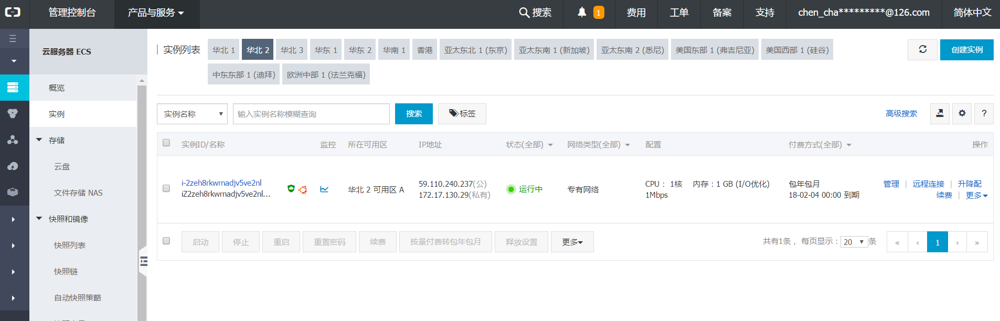

# 项目部署 \|

基于ubuntu 16.04系统，使用 Gunicorn + Nginx 进行布署，云服务器为阿里云

## 学习目标 <a id="&#x5B66;&#x4E60;&#x76EE;&#x6807;"></a>

* 能够理解 Nginx 服务器的作用
* 能够使用 Gunicorn + Nginx 实现简单的 helloworld 程序部署

## 阿里云服务器 <a id="&#x963F;&#x91CC;&#x4E91;&#x670D;&#x52A1;&#x5668;"></a>

* 选择云服务器:阿里云服务器 [https://www.aliyun.com](https://www.aliyun.com/)
* 个人免费获取 \[[https://free.aliyun.com/](https://free.aliyun.com/)\]
* 创建服务器选择ubuntu16.04 64位的操作系统
* 进入控制台,查看实例创建情况



* 给安全组配置规则，添加5000端口\(一并加上5001端口\)
* 利用命令行进行远程服务器登录

```text
ssh 用户名@ip地址
```

## 相关环境安装 <a id="&#x76F8;&#x5173;&#x73AF;&#x5883;&#x5B89;&#x88C5;"></a>

以下操作都在远程服务器上进行操作 \(ubuntu 16.04\)

* 先更新 apt 相关源

```text
sudo apt-get update
```

* mysql安装

```text
apt-get install mysql-server
apt-get install libmysqlclient-dev
```

* redis安装

```text
sudo apt-get install redis-server
```

* 安装虚拟环境

```text
pip install virtualenv
pip install virtualenvwrapper
```

* 使得安装的virtualenvwrapper生效，编辑~/.bashrc文件，内容如下:

```text
export WORKON_HOME=$HOME/.virtualenvs
export PROJECT_HOME=$HOME/workspace
source /usr/local/bin/virtualenvwrapper.sh
```

* 使编辑后的文件生效

```text
source ~/.bashrc
```

## requirements文件 <a id="requirements&#x6587;&#x4EF6;"></a>

Python 项目中可以包含一个 requirements.txt 文件，用于记录所有依赖包及其精确的版本号，以便在新环境中进行部署操作。

* 在虚拟环境使用以下命令将当前虚拟环境中的依赖包以版本号生成至文件中：

```text
pip freeze > requirements.txt
```

* 当需要创建这个虚拟环境的完全副本，可以创建一个新的虚拟环境，并在其上运行以下命令：

```text
pip install -r requirements.txt
```

* 在安装 Flask-MySQLdb 的时候可能会报错，可能是依赖包没有安装，执行以下命令安装依赖包：

```text
sudo apt-get build-dep python-mysqldb
```

## Nginx <a id="nginx"></a>

* 采用 C 语言编写
* 实现分流、转发、负载均衡

### 相关操作 <a id="&#x76F8;&#x5173;&#x64CD;&#x4F5C;"></a>

* 安装

```text
$ sudo apt-get install nginx
```

* 运行及停止

```text
/etc/init.d/nginx start #启动
/etc/init.d/nginx stop  #停止
```

* 配置文件
  * 编辑文件:/etc/nginx/sites-available/default

```text


upstream flask {
        server 127.0.0.1:5000;
        server 127.0.0.1:5001;
}
server {
        
        listen 80 default_server;
        listen [::]:80 default_server;

        root /var/www/html;

        index index.html index.htm index.nginx-debian.html;

        server_name _;

        location / {
                
                proxy_pass http://127.0.0.1:5000;
                
                
                
                proxy_set_header Host $host;
                
                proxy_set_header X-Real-IP $remote_addr;
        }
}
```

## Gunicorn <a id="gunicorn"></a>

* Gunicorn（绿色独角兽）是一个Python WSGI的HTTP服务器
* 从Ruby的独角兽（Unicorn ）项目移植
* 该Gunicorn服务器与各种Web框架兼容，实现非常简单，轻量级的资源消耗
* Gunicorn直接用命令启动，不需要编写配置文件

### 相关操作 <a id="&#x76F8;&#x5173;&#x64CD;&#x4F5C;"></a>

* 安装

```text
pip install gunicorn
```

* 查看选项

```text
gunicorn -h
```

* 运行

```text

gunicorn -w 2 -b 127.0.0.1:5000 运行文件名称:Flask程序实例名
```

参考阅读： Gunicorn相关配置：[https://blog.csdn.net/y472360651/article/details/78538188](https://blog.csdn.net/y472360651/article/details/78538188)

## 其他操作 <a id="&#x5176;&#x4ED6;&#x64CD;&#x4F5C;"></a>

* 拷贝本地代码到远程

```text
scp -r 本地文件路径 root@39.106.21.198:远程保存路径
```

