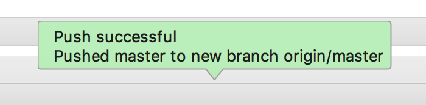

# Git版本控制 \|

## 本地提交 <a id="&#x672C;&#x5730;&#x63D0;&#x4EA4;"></a>

* 初始化 git

```text
$ cd [项目目录]
$ git init
```

* 配置当前项目git提交信息\(可省略此步，如不配置则使用全局配置\)

```text
git config user.name XXX
git config user.email XXX@xxx.com
```

* 添加忽略文件

```text
$ touch .gitignore
```

* 设置忽略文件内容\(后续根据需要再添加\)

```text
.idea
*.py[cod]
```

* 添加所有文件到暂存区

```text
$ git add .
```

* 提交到本地仓库并填写注释

```text
$ git commit -m'第一次提交'
```

* 让 Pycharm 管理当前项目的 git

## 远程提交 <a id="&#x8FDC;&#x7A0B;&#x63D0;&#x4EA4;"></a>

使用码云 [https://gitee.com/](https://gitee.com/) 作为在线 git 源代码仓库，免费注册账号

* 在码云上创建项目：
* 创建完成之后，将已有项目上传到码云：

### 上传项目到码云 <a id="&#x4E0A;&#x4F20;&#x9879;&#x76EE;&#x5230;&#x7801;&#x4E91;"></a>

#### 方式1：使用命令行的形式将项目上传到码云 <a id="&#x65B9;&#x5F0F;1&#xFF1A;&#x4F7F;&#x7528;&#x547D;&#x4EE4;&#x884C;&#x7684;&#x5F62;&#x5F0F;&#x5C06;&#x9879;&#x76EE;&#x4E0A;&#x4F20;&#x5230;&#x7801;&#x4E91;"></a>

```text
$ cd 项目根目录
$ git remote add origin 仓库地址
$ git push -u origin master
```

#### 方式2：使用Pycharm将项目上传到码云 <a id="&#x65B9;&#x5F0F;2&#xFF1A;&#x4F7F;&#x7528;pycharm&#x5C06;&#x9879;&#x76EE;&#x4E0A;&#x4F20;&#x5230;&#x7801;&#x4E91;"></a>

* 拷贝地址
* 添加远程地址
* 输入远程地址
* 输入码云的账号和密码并点击`OK`
* 选择菜单中的 `VCS` -&gt; `Git` -&gt; `Push`
* Push 成功之后 Pycharm 弹出的提示



> 去码云上刷新当前项目查看Push结果

## 回滚代码 <a id="&#x56DE;&#x6EDA;&#x4EE3;&#x7801;"></a>

* 回滚到上一版本

```text
$ git reset --hard HEAD~1
```

* 查看所有提交版本记录

```text
$ git reflog
```

* 回到指定版本

```text
$ git reset --hard 提交id
```

